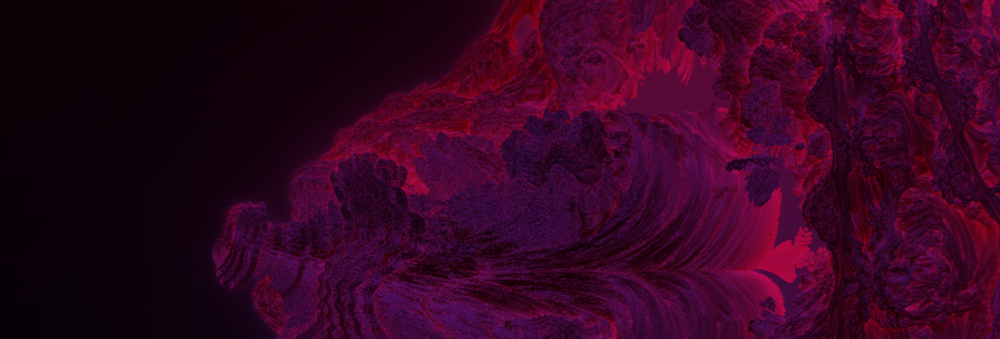
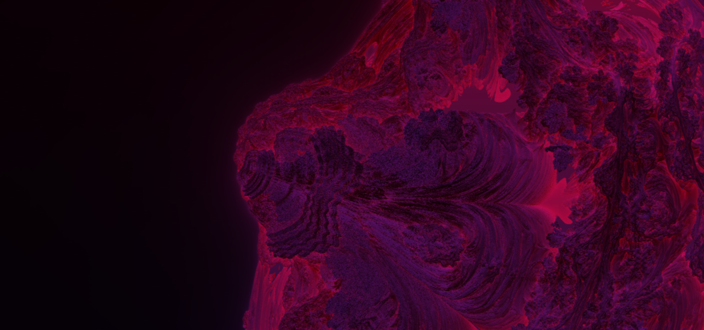
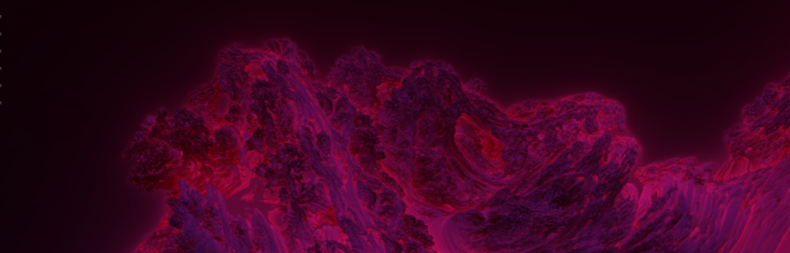

# CUDA Raymarcher

A sample / experimental ray-marching renderer implemented with CUDA. Designed to explore GPU acceleration, distance fields, and basic shading in a CUDA environment.

---

## Overview

This project demonstrates:
- Ray-marching of signed distance fields (SDFs) on the GPU using NVIDIA CUDA.  
- Use of CUDA kernels to compute ray intersections, normals, and perform simple shading.  
- Use of raylib for rendering and implement a UI.
- Performance considerations (step size, iteration limits, etc.).  
- Rendering to an image buffer and saving the result.  

---

## Structure

```
/
├── src/ — source files (CUDA code, host/C++ orchestration)
├── include/ — header files, shared declarations
├── external/ — any third-party helper libs or dependencies
├── builds/ — compiled binaries / build artifacts
├── saved_image.png — example output image
├── Makefile — build script

```
---

## Screenshots



